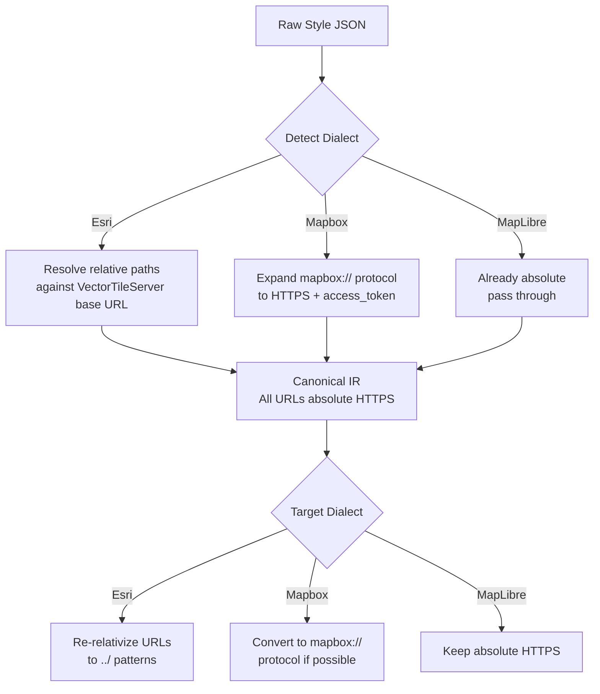
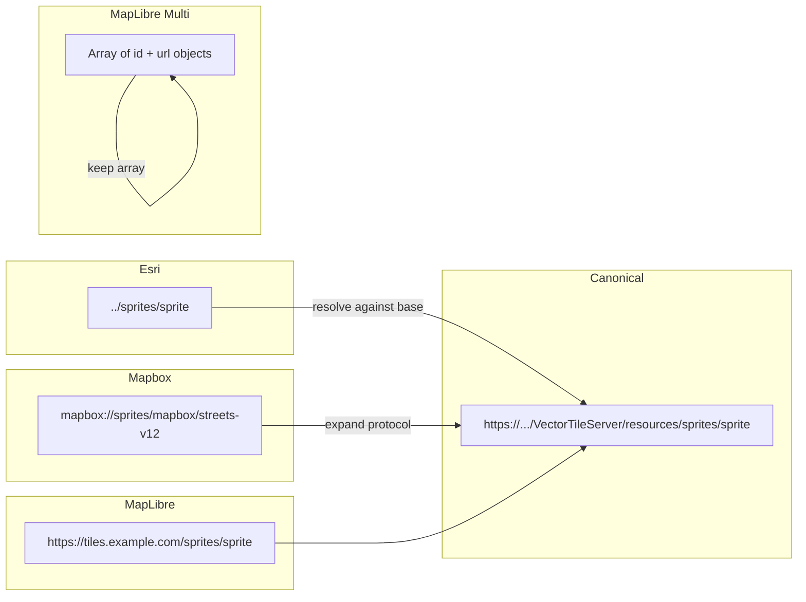

# URL Resolution: Sprites, Glyphs, Sources, and Tiles

## The core problem

Each dialect uses different URL patterns for the same resources. The transpiler must resolve, rewrite, and re-relativize URLs depending on source and target dialects.

## URL resolution flow



## Source URL resolution

### Esri -> IR (absolute)

Esri styles always have:
```json
"sources": { "esri": { "type": "vector", "url": "../../" } }
```

The style lives at `{base}/resources/styles/root.json`, so `../../` resolves to `{base}/`.

**Transform:**
```
Input:  source.url = "../../"
        baseUrl = "https://basemaps.arcgis.com/arcgis/rest/services/World_Basemap_v2/VectorTileServer"

Output: source.tiles = ["https://basemaps.arcgis.com/arcgis/rest/services/World_Basemap_v2/VectorTileServer/tile/{z}/{y}/{x}.pbf"]
        (source.url deleted)
```

**Important:** Esri tile URLs use `{z}/{y}/{x}` order (row before column), not `{z}/{x}/{y}`.

### Mapbox -> IR (absolute)

```
Input:  source.url = "mapbox://mapbox.mapbox-streets-v8"

Output: source.url = "https://api.mapbox.com/v4/mapbox.mapbox-streets-v8.json?secure&access_token=..."
```

Or for composite sources:
```
Input:  source.url = "mapbox://mapbox.mapbox-streets-v8,mapbox.mapbox-terrain-v2"

Output: source.url = "https://api.mapbox.com/v4/mapbox.mapbox-streets-v8,mapbox.mapbox-terrain-v2.json?secure&access_token=..."
```

### IR -> Esri (re-relativize)

When emitting Esri format, convert absolute source URLs back to relative:
```
Input:  source.tiles = ["https://...VectorTileServer/tile/{z}/{y}/{x}.pbf"]
Output: source.url = "../../"
        (source.tiles deleted)
```

This requires the `baseUrl` to be provided in emit options.

## Sprite URL resolution



### Esri sprite resolution
```
Input:  sprite = "../sprites/sprite"
        baseUrl = "https://basemaps.arcgis.com/.../VectorTileServer"

Step 1: Resolve relative path
        "{baseUrl}/resources/styles/" + "../sprites/sprite"
        = "{baseUrl}/resources/sprites/sprite"

Output: sprite = "https://basemaps.arcgis.com/.../VectorTileServer/resources/sprites/sprite"
```

The renderer then fetches:
- `{sprite}.json` (sprite index)
- `{sprite}.png` (sprite sheet)
- `{sprite}@2x.json` / `{sprite}@2x.png` (HiDPI)

### Mapbox sprite resolution
```
Input:  sprite = "mapbox://sprites/mapbox/streets-v12"

Output: sprite = "https://api.mapbox.com/styles/v1/mapbox/streets-v12/sprite?access_token=..."
```

### MapLibre multi-sprite handling
```json
"sprite": [
  {"id": "default", "url": "https://example.com/sprites/default"},
  {"id": "maki", "url": "https://example.com/sprites/maki"}
]
```

When converting to Mapbox or Esri (which don't support multi-sprite):
- Use the first sprite entry as the single sprite URL
- Emit a warning: `"Multi-sprite array collapsed to single sprite. Icons from non-default sprites may be missing."`

## Glyph / Font URL resolution

### Esri glyph resolution
```
Input:  glyphs = "../fonts/{fontstack}/{range}.pbf"
        baseUrl = "https://basemaps.arcgis.com/.../VectorTileServer"

Output: glyphs = "https://basemaps.arcgis.com/.../VectorTileServer/resources/fonts/{fontstack}/{range}.pbf"
```

### Mapbox glyph resolution
```
Input:  glyphs = "mapbox://fonts/mapbox/{fontstack}/{range}.pbf"

Output: glyphs = "https://api.mapbox.com/fonts/v1/mapbox/{fontstack}/{range}.pbf?access_token=..."
```

### Template tokens
Both `{fontstack}` and `{range}` are literal template placeholders. They must be preserved as-is during URL resolution. They are not variables to substitute during transpilation.

## Token / API key handling

### Esri tokens

> See [09-esri-authentication.md](09-esri-authentication.md) for the full deep-dive on Esri auth patterns, token types, and security.

```
Input URL:  https://...VectorTileServer?token=abc123
```
- Token is extracted from the base URL (or `options.token`, or from existing sprite/glyph URLs)
- There is NO `?apiKey=` parameter. API keys use the same `?token=` param
- The same token is appended to ALL resolved URLs (tiles, sprites, glyphs, metadata)
- In the canonical IR, URLs are stored WITHOUT tokens (token lives in TransformContext)
- When emitting, token is re-injected into all output URLs
- Esri also supports `X-Esri-Authorization: Bearer <token>` header (not applicable for static style JSON, but relevant for runtime)
- Token priority: `options.token` > URL query param > tokens in style JSON URLs

### Mapbox access tokens
```
?access_token=pk.eyJ1Ijoi...
```
- Required for all `mapbox://` -> HTTPS expansions
- Must be provided via `options.mapboxAccessToken`
- When converting FROM Mapbox, the token is stripped from the IR (URLs become token-free)
- When converting TO Mapbox, the token is re-injected

### MapLibre / open sources
- Most open tile providers (OpenFreeMap, MapLibre demo tiles) require no token
- Some (Stadia Maps, MapTiler, Protomaps) use API keys in query params or headers
- The transpiler preserves existing query parameters by default

## Tile URL patterns

| Provider | Pattern | Coordinate order |
|----------|---------|-----------------|
| Esri VectorTileServer | `{base}/tile/{z}/{y}/{x}.pbf` | z/y/x (row-major) |
| Mapbox | `https://api.mapbox.com/v4/{tileset}/{z}/{x}/{y}.pbf` | z/x/y (column-major) |
| MapLibre / generic | `{base}/{z}/{x}/{y}.pbf` | z/x/y (column-major) |
| PMTiles | `pmtiles://{url}` (virtual, handled by protocol) | N/A (internal) |
| TMS | `{base}/{z}/{x}/{flipped_y}.png` | z/x/y (y-flipped) |

**Note on Esri {z}/{y}/{x} order:** This is not a TMS y-flip. It is the same y-origin as standard web mercator (top-left = 0), just with row and column swapped. MapLibre renders Esri tiles correctly when the tile URL uses this pattern.

## Edge case: Esri item-based styles

Some Esri styles come from ArcGIS Online items, not VectorTileServer endpoints:
```
https://www.arcgis.com/sharing/rest/content/items/{ITEM_ID}/resources/styles/root.json
```

In this case:
- The `../../` source URL resolves to `.../items/{ITEM_ID}/`
- This is NOT a VectorTileServer endpoint
- The actual tile endpoint must be discovered via the item's metadata
- The transpiler should detect this pattern and warn that `baseUrl` must be provided manually

## Edge case: Already-resolved Esri styles

If someone has already resolved Esri relative paths (e.g., using `resolveEsriRelativePaths` from the current library), the sprite/glyph/source URLs are already absolute. The parser detects this via:
- `sprite` doesn't start with `../`
- Source URL contains `VectorTileServer` (still identifiable as Esri)
- In this case, skip relative path resolution
