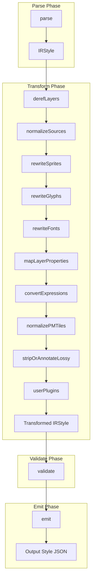
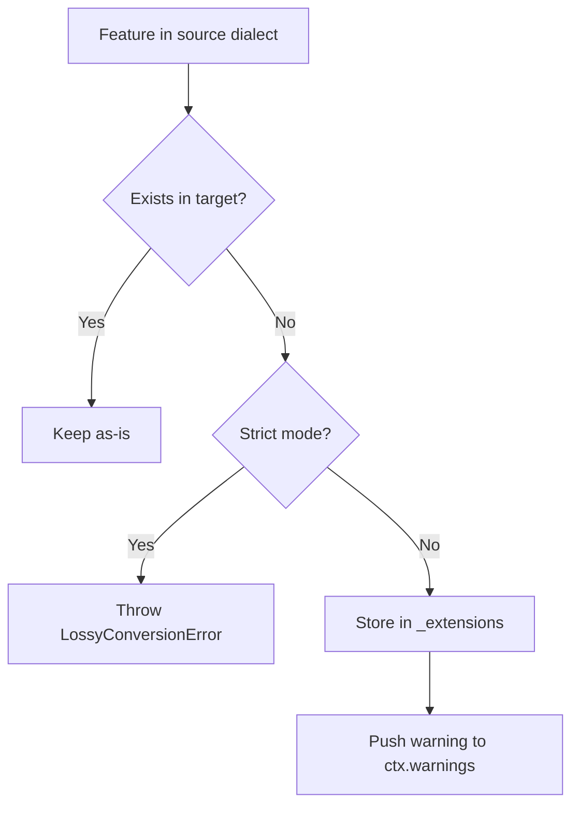

# Transform Pipeline

## Pipeline architecture



Each transform is a pure function: `(style: IRStyle, ctx: TransformContext) -> IRStyle`. No mutation. Every step returns a new object.

## Transform context

```typescript
interface TransformContext {
  sourceDialect: Dialect;
  targetDialect: Dialect;
  baseUrl?: string;              // Esri VectorTileServer base URL
  esriToken?: string;            // Esri token (API key, OAuth, or legacy). See 09-esri-authentication.md
  mapboxAccessToken?: string;    // Mapbox access token (pk.eyJ1...)
  fontMapping?: Record<string, string>;  // Font replacement map
  plugins: Plugin[];
  warnings: ConversionWarning[];
  options: TranspileOptions;
}
```

## Built-in transforms

### 1. derefLayers

**Purpose:** Resolve layer `ref` inheritance. Some older styles use `"ref": "other-layer-id"` to inherit `type`, `source`, `source-layer`, `minzoom`, `maxzoom`, `filter`, `layout` from another layer.

**When needed:** Mapbox v7/v8 legacy styles, some MapLibre styles.

**Logic:**
```
For each layer with a "ref" property:
  1. Find the referenced layer
  2. Copy inherited properties (type, source, source-layer, minzoom, maxzoom, filter, layout)
  3. Delete the "ref" property
```

### 2. normalizeSources

**Purpose:** Convert between `source.url` (TileJSON endpoint) and `source.tiles` (direct tile URL array) depending on target dialect requirements.

**Esri -> IR:** Convert `url: "../../"` to `tiles: ["{base}/tile/{z}/{y}/{x}.pbf"]`
**Mapbox -> IR:** Expand `mapbox://` URLs to HTTPS
**IR -> Esri:** Convert back to relative `url: "../../"`
**IR -> MapLibre:** Keep `tiles` array (preferred) or `url` (both valid)

### 3. rewriteSprites

**Purpose:** Normalize sprite URLs to absolute HTTPS.

**Handles:**
- Esri relative `../sprites/sprite` -> absolute
- Mapbox `mapbox://sprites/...` -> HTTPS
- MapLibre multi-sprite `[{id, url}]` -> preserved for MapLibre target, collapsed for others
- Token/access_token injection

### 4. rewriteGlyphs

**Purpose:** Normalize glyph URLs to absolute HTTPS.

**Handles:**
- Esri relative `../fonts/{fontstack}/{range}.pbf` -> absolute
- Mapbox `mapbox://fonts/...` -> HTTPS
- Preserves `{fontstack}` and `{range}` template tokens

### 5. rewriteFonts

**Purpose:** Handle font stack incompatibilities across dialects.

**Logic:**
```
If fontMapping is provided in options:
  For each layer with text-font property:
    For each font name in the stack:
      If font is in fontMapping, replace it
      
If no fontMapping:
  Check if font stacks use dialect-specific fonts
  If target dialect is unlikely to have these fonts:
    Push a warning with severity "warn"
```

**Default font mappings (suggested, user-overridable):**

| From | To (suggested MapLibre) |
|------|------------------------|
| `Arial Regular` (Esri) | `Open Sans Regular` |
| `Arial Bold` (Esri) | `Open Sans Bold` |
| `Arial Italic` (Esri) | `Open Sans Italic` |
| `DIN Pro Regular` (Mapbox) | `Open Sans Regular` |
| `DIN Pro Medium` (Mapbox) | `Open Sans Semibold` |
| `DIN Pro Bold` (Mapbox) | `Open Sans Bold` |
| `DIN Pro Italic` (Mapbox) | `Open Sans Italic` |

### 6. mapLayerProperties

**Purpose:** Map property names and values that differ between dialects.

**Known mappings:**

| Property | Mapbox | MapLibre | Notes |
|----------|--------|----------|-------|
| `visibility` | `"visible" \| "none"` | Can be expression | MapLibre extended |
| `hillshade-method` | N/A | `"standard" \| "basic" \| "combined" \| "multidirectional"` | MapLibre-only |
| `*-emissive-strength` | All layers | N/A | Mapbox PBR only |
| `*-use-theme` | All layers | N/A | Mapbox color-theme only |
| `*-occlusion-opacity` | Some layers | N/A | Mapbox 3D only |

**Strategy:**
- If target supports the property: keep it
- If target does not support: remove it, push warning
- No property value transformation needed for the core set (fill, line, symbol, circle)

### 7. convertExpressions

**Purpose:** Handle expression compatibility between dialects.

**Esri legacy stops -> modern expressions (optional):**
```json
// Input (Esri legacy)
{"stops": [[5, "#ff0000"], [10, "#0000ff"]]}

// Output (modern expression)
["interpolate", ["linear"], ["zoom"], 5, "#ff0000", 10, "#0000ff"]
```

This conversion is **optional** because MapLibre still supports legacy stops. Enable via `options.modernizeExpressions: true`.

**Mapbox-only expressions (stripped when targeting MapLibre or Esri):**
- `config` -> warning + remove (Mapbox Standard Style theming)
- `measure-light` -> warning + remove (PBR lighting queries)
- `worldview` -> warning + remove (disputed border filtering)
- `is-active-floor` -> warning + remove (3D indoor maps)
- `random` -> warning + remove (deterministic pseudo-random values)
- `hsl` / `hsla` -> warning + remove (HSL color expressions, not CSS strings)
- `distance-from-center` -> warning + remove (camera-dependent styling)

**MapLibre-only expressions (stripped when targeting Mapbox or Esri):**
- `global-state` -> warning + remove (runtime state variables)
- `elevation` -> warning + remove (terrain elevation queries)
- `split` -> warning + remove (string splitting)
- `join` -> warning + remove (array joining)

**Esri-unsupported expressions (stripped when targeting Esri only):**
- `within` -> warning + remove (geospatial containment)
- `distance` -> warning + remove (distance to geometry)
- `accumulated` -> warning + remove (cluster aggregation)
- `line-progress` -> warning + remove (gradient along line)
- `is-supported-script` -> warning + remove (script detection)

### 8. normalizePMTiles

**Purpose:** Handle PMTiles source protocol.

**PMTiles sources look like:**
```json
"sources": {
  "buildings": {
    "type": "vector",
    "url": "pmtiles://https://example.com/buildings.pmtiles"
  }
}
```

**Logic:**
- If target is MapLibre: keep `pmtiles://` URLs as-is (MapLibre supports them via protocol handler)
- If target is Mapbox or Esri: strip `pmtiles://` prefix, push warning that PMTiles requires a protocol handler and is not natively supported
- Alternatively, convert to a TileJSON URL if a PMTiles-to-TileJSON proxy is known

### 9. stripOrAnnotateLossy

**Purpose:** Handle features that exist in the source dialect but not in the target.



**Lossy features by conversion direction:**

**Mapbox -> MapLibre (drop list):**
- `fog` (Mapbox atmosphere)
- `lights` (Mapbox PBR lighting array)
- `imports` / `schema` / `config` (style composition)
- `snow` / `rain` (atmospheric particles)
- `camera` (projection config)
- `color-theme` (color LUT)
- `models` / `iconsets` / `featuresets` / `indoor`
- Layer types: `building`, `model`, `raster-particle`, `slot`, `clip`
- Properties: `*-emissive-strength`, `*-use-theme`, `*-occlusion-opacity`
- Expressions: `config`, `measure-light`, `worldview`, `is-active-floor`, `random`, `hsl`, `hsla`, `distance-from-center`
- Mapbox API fields: `owner`, `visibility`, `draft`, `created`, `modified`

**Mapbox -> Esri (drop list):**
- Everything in the MapLibre drop list, plus:
- `terrain`, `sky`, `light` (Esri styles have no top-level rendering config)
- `name`, `metadata`, `center`, `zoom`, `bearing`, `pitch`, `transition`
- Layer types: `raster`, `heatmap`, `hillshade`, `sky`, `color-relief`
- All non-`fill`/`line`/`symbol`/`circle`/`fill-extrusion`/`background` layer types
- Expressions: `within`, `distance`, `accumulated`, `line-progress`, `is-supported-script`

**MapLibre -> Mapbox (drop list):**
- `state` (global state)
- `font-faces` (direct font files)
- `centerAltitude`, `roll` (6DOF camera)
- Layer type: `color-relief`
- Expressions: `global-state`, `elevation`, `split`, `join`
- Multi-sprite array -> collapse to single

**MapLibre -> Esri (drop list):**
- Everything in Mapbox -> Esri drop list, plus:
- `state`, `font-faces`, `centerAltitude`, `roll`
- Expressions: `global-state`, `elevation`, `split`, `join`

### 10. userPlugins

**Purpose:** Run user-provided plugin transforms.

```typescript
for (const plugin of ctx.plugins) {
  if (plugin.afterTransform) {
    style = plugin.afterTransform(style, ctx);
  }
}
```

## Transform ordering rationale

1. **derefLayers first** because later transforms need to see the resolved layer properties
2. **normalizeSources** and **rewriteSprites/Glyphs** early because URL patterns affect everything
3. **rewriteFonts** after glyphs because font mapping may need glyph URL context
4. **mapLayerProperties** in the middle because it may create/remove properties that affect expression checks
5. **convertExpressions** late because it operates on final property values
6. **normalizePMTiles** near the end because it's a niche transform
7. **stripOrAnnotateLossy** near-last because it's the final cleanup
8. **userPlugins** last so they see the near-final state
