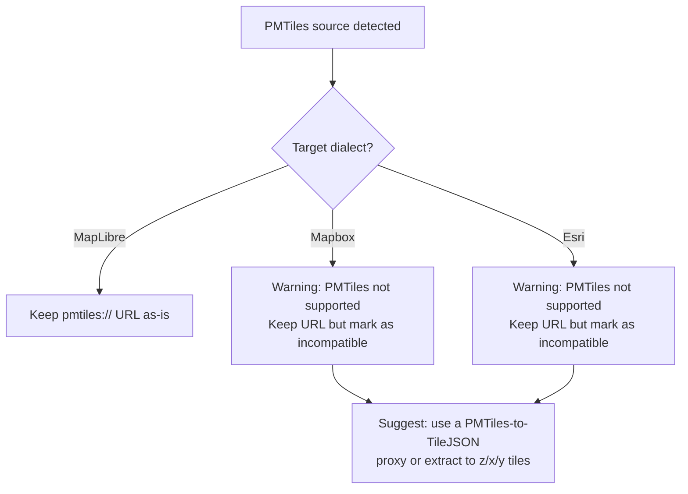

# Edge Cases and Limitations

## PMTiles support

### What PMTiles is
PMTiles is a single-file archive format for tiled data. Instead of individual `{z}/{x}/{y}.pbf` requests, a single `.pmtiles` file on a static host (S3, CloudFront, etc.) serves all tiles via HTTP range requests.

### How PMTiles appears in styles
```json
"sources": {
  "buildings": {
    "type": "vector",
    "url": "pmtiles://https://example.com/buildings.pmtiles"
  }
}
```

The `pmtiles://` prefix is a **virtual protocol**. It requires a client-side protocol handler:
```javascript
import { Protocol } from 'pmtiles';
const protocol = new Protocol();
maplibregl.addProtocol('pmtiles', protocol.tile);
```

### PMTiles compatibility matrix

| Runtime | PMTiles support | Notes |
|---------|----------------|-------|
| MapLibre GL JS | Yes (via protocol handler) | First-class community support |
| MapLibre Native | Partial | Depends on platform |
| Mapbox GL JS | No | No `addProtocol` API for sources |
| ArcGIS JS API | No | No custom protocol support |
| Leaflet + pmtiles | Yes | Via separate plugin |

### Transpiler behavior



**Warning code:** `PMTILES_UNSUPPORTED_TARGET`

### Overture Maps PMTiles specifically
Overture Maps distributes data as PMTiles (buildings, places, transportation, base, addresses, divisions). These are raw tile data without a style.json. The transpiler does not create styles from raw tiles, only converts existing styles. A user would need to write a MapLibre style referencing Overture PMTiles sources and then use the transpiler to convert that style.

---

## Esri edge cases

### Non-Web Mercator projections (EPSG:4326, custom)

Some Esri VectorTileServer services use WGS84 (`World_Basemap_GCS_v2`) or custom projections (LV95 for Switzerland, RD for Netherlands).

**Problem:** MapLibre and Mapbox assume Web Mercator (EPSG:3857) by default. Non-Mercator tiles will render incorrectly without proper projection configuration.

**Transpiler behavior:**
- Detect non-Mercator via VectorTileServer metadata (if fetched) or known URL patterns
- Emit a warning: `"Source uses non-Web Mercator projection. MapLibre/Mapbox may render tiles incorrectly without projection configuration."`
- Warning code: `NON_MERCATOR_PROJECTION`

### Esri item-based style URLs

```
https://www.arcgis.com/sharing/rest/content/items/{ITEM_ID}/resources/styles/root.json
```

The `../../` relative URL in sources resolves to `.../items/{ITEM_ID}/`, which is NOT a VectorTileServer endpoint. The actual tile server URL must be discovered from the item metadata.

**Transpiler behavior:**
- If `baseUrl` is provided and contains `/VectorTileServer`: use it directly
- If `baseUrl` is provided and contains `/items/`: warn that tile URLs may not resolve correctly
- If no `baseUrl`: attempt to detect from sprite/glyph URLs if they're already absolute
- Warning code: `ESRI_ITEM_URL_NEEDS_BASE`

### Esri token expiration

Esri tokens have expiration times. A transpiled style with an embedded `?token=...` will stop working when the token expires.

**Transpiler behavior:**
- Token is preserved as-is (no validation of expiry)
- Document that users should handle token refresh at the application level

### Source-layer names with colons

Some Esri VTPKs use colon-suffixed source-layer names for zoom-generalized slices:
```
"County:1" (zoom 3.96-4.89)
"County:2" (zoom 4.89-6.62)
```

**Transpiler behavior:** Pass through as-is. MapLibre handles colons in source-layer names correctly.

### Esri `_symbol` attribute

The `_symbol` integer filter is valid Mapbox/MapLibre filter syntax. No transformation needed. But:
- If the target renderer does not have the Esri tile data, `_symbol` attributes won't exist in features
- This is expected behavior (the style is tied to the tile data)

### Esri layer ID slashes

Layer IDs like `"Land/Not ice"` are valid in MapLibre GL JS. No transformation needed. Older Mapbox GL JS versions (<1.0) had issues with slashes in IDs, but modern versions handle them fine.

### Esri legacy stops only

All Esri styles use legacy `{"stops": [[z, v], ...]}` syntax, never modern expressions. Both MapLibre and Mapbox still support legacy stops, so no conversion is required for correctness. Optional `modernizeExpressions` flag converts them.

---

## Mapbox edge cases

### Composite sources

```json
"sources": {
  "composite": {
    "type": "vector",
    "url": "mapbox://mapbox.mapbox-streets-v8,mapbox.mapbox-terrain-v2,mapbox.mapbox-bathymetry-v2"
  }
}
```

Multiple tileset IDs comma-separated in one source. This is Mapbox-specific.

**Transpiler behavior when targeting MapLibre:**
- Option A: Keep as single source URL (if resolved to HTTPS, it works)
- Option B: Split into separate sources (each layer referencing the original source gets remapped)
- Default: Option A (simpler, keeps layer references valid)
- Warning code: `MAPBOX_COMPOSITE_SOURCE`

### Mapbox proprietary fonts

`DIN Pro` font family is licensed by Mapbox and not freely available. Styles using DIN Pro will show fallback fonts (or blank text) in MapLibre unless a compatible font server is configured.

**Transpiler behavior:**
- If `fontMapping` is provided: apply it
- If not: warn about proprietary fonts
- Warning code: `PROPRIETARY_FONT`

### Mapbox v3 style imports

```json
"imports": [
  {
    "id": "basemap",
    "url": "mapbox://styles/mapbox/standard",
    "config": { "lightPreset": "day" }
  }
]
```

The `imports` system composes multiple styles into one. The imported styles are fetched and merged at runtime by Mapbox GL JS.

**Transpiler behavior:**
- Cannot resolve imports without network access
- Drop `imports` from the output
- Warning: `"Mapbox style imports cannot be resolved without fetching. The imported layers will be missing from the output."`
- Warning code: `MAPBOX_IMPORTS_DROPPED`
- If `fetch` adapter is provided in options, optionally resolve imports inline

### Mapbox `slot` layers

Slot layers are insertion points for the import/composition system:
```json
{ "id": "labels-slot", "type": "slot" }
```

**Transpiler behavior:** Drop slot layers when targeting MapLibre/Esri. Push warning.

### Mapbox API metadata fields

Top-level fields added by the Mapbox Styles API: `owner`, `visibility`, `draft`, `created`, `modified`, `id` (style ID, not to be confused with style `name`).

**Transpiler behavior:** Strip these from the output. They are not part of the style spec.

---

## MapLibre edge cases

### Multi-sprite arrays

```json
"sprite": [
  {"id": "default", "url": "https://example.com/sprites/default"},
  {"id": "custom", "url": "https://example.com/sprites/custom"}
]
```

**Transpiler behavior when targeting Mapbox/Esri:**
- Collapse to the first sprite entry (or the one with `id: "default"`)
- Warn that icons from other sprite sets may be missing
- Warning code: `MULTI_SPRITE_COLLAPSED`

### `font-faces` property

MapLibre v5+ supports direct font file URLs instead of pre-rendered SDF glyphs:
```json
"font-faces": [
  {
    "family": "Noto Sans",
    "style": "normal",
    "weight": 400,
    "url": "https://example.com/fonts/NotoSans-Regular.ttf"
  }
]
```

**Transpiler behavior when targeting Mapbox/Esri:**
- Drop `font-faces`
- If `glyphs` URL exists: keep it (fonts will load from glyph endpoint)
- If no `glyphs` URL: warn that text rendering may fail
- Warning code: `FONT_FACES_DROPPED`

### `state` and `global-state` expressions

MapLibre's global state system allows runtime style manipulation:
```json
"state": {
  "showLabels": { "type": "boolean", "default": true }
}
```

Used in expressions: `["global-state", "showLabels"]`

**Transpiler behavior when targeting Mapbox/Esri:**
- Drop `state` from top-level
- Replace `global-state` expressions with their default values
- Warning code: `GLOBAL_STATE_DROPPED`

### `color-relief` layer type

MapLibre-only layer type for elevation-based coloring.

**Transpiler behavior when targeting Mapbox/Esri:**
- Drop the layer entirely
- Warning code: `UNSUPPORTED_LAYER_TYPE`

### MapLibre Tiles (MLT) encoding

```json
"sources": {
  "data": {
    "type": "vector",
    "encoding": "mlt",
    "url": "https://example.com/tiles.json"
  }
}
```

`mlt` is MapLibre's new binary tile format (experimental, v5.12+).

**Transpiler behavior when targeting Mapbox/Esri:**
- Remove `encoding: "mlt"` (unknown property to Mapbox/Esri)
- Warning: tile data in MLT format cannot be read by Mapbox/Esri renderers
- Warning code: `MLT_ENCODING_UNSUPPORTED`

---

## Cross-dialect edge cases

### Tile coordinate order

| Dialect | Pattern | Example |
|---------|---------|---------|
| Esri | `{z}/{y}/{x}` | `tile/5/12/8.pbf` |
| Mapbox | `{z}/{x}/{y}` | `v4/mapbox.streets/5/8/12.pbf` |
| MapLibre | `{z}/{x}/{y}` | `data/5/8/12.pbf` |
| TMS | `{z}/{x}/{flipped_y}` | `tiles/5/8/19.png` |

The transpiler does NOT rewrite coordinate order in tile URL templates. The `{z}`, `{x}`, `{y}` placeholders are preserved as-is. The correct template is set during source normalization based on the source dialect.

### Empty styles

A style with no layers and no sources is valid:
```json
{ "version": 8, "sources": {}, "layers": [] }
```

The transpiler should handle this without errors. Detection returns `"maplibre"` (default).

### Extremely large styles

Some Esri basemaps have 900+ layers (World_Basemap_v2: 906, OpenStreetMap_v2: 1524). The transpiler must handle these efficiently. No recursive algorithms that could stack overflow. Use iterative transforms.

### Circular layer references

A layer with `"ref"` pointing to itself or creating a cycle. The `derefLayers` transform must detect and break cycles.

### Invalid JSON input

The `transpile()` function accepts `unknown`. If the input is a string, attempt to parse it as JSON. If parsing fails, throw a descriptive error.

### Mixed-dialect styles

A style that has been partially converted (e.g., Esri relative sprite path but already-resolved source URLs). The parser should handle each field independently, not assume all-or-nothing conversion.

---

## Known limitations (document clearly)

1. **No tile data transformation.** The transpiler converts style JSON only. It does not re-encode tiles, re-project geometries, or transform feature attributes.

2. **No runtime style mutation.** The transpiler produces static JSON output. Runtime features like Mapbox's `config` system or MapLibre's `global-state` are resolved to their default values.

3. **No network fetching by default.** The core library is synchronous and fetch-free. Network-dependent operations (fetching TileJSON, resolving Mapbox imports, discovering Esri item metadata) require an optional `fetch` adapter.

4. **Font rendering depends on the glyph server.** Converting a style from Esri to MapLibre does not make Esri's fonts available on the MapLibre glyph server. Font mapping is advisory.

5. **Sprite icon compatibility.** Converting a style from one dialect to another does not port the sprite sheet. The target renderer must have access to the same sprite endpoint or a compatible one.

6. **Proprietary extensions are lossy.** Mapbox fog, 3D buildings, PBR lighting, style imports, and other proprietary features have no equivalent in MapLibre or Esri. They are dropped with warnings.

7. **Esri custom projections.** Non-Mercator Esri tiles (WGS84, LV95, RD) may not render correctly in MapLibre/Mapbox without additional projection configuration.

8. **PMTiles is MapLibre-only.** Styles using PMTiles sources cannot be natively rendered by Mapbox or Esri.

9. **Mapbox composite source splitting is not automatic.** Composite `mapbox://a,b,c` sources are kept as single sources when converting. Manual splitting is possible via plugins.

10. **No style version upgrades.** The transpiler expects v8 styles. v7 styles must be migrated to v8 first (MapLibre's `migrate()` utility can do this, but we don't bundle it).
