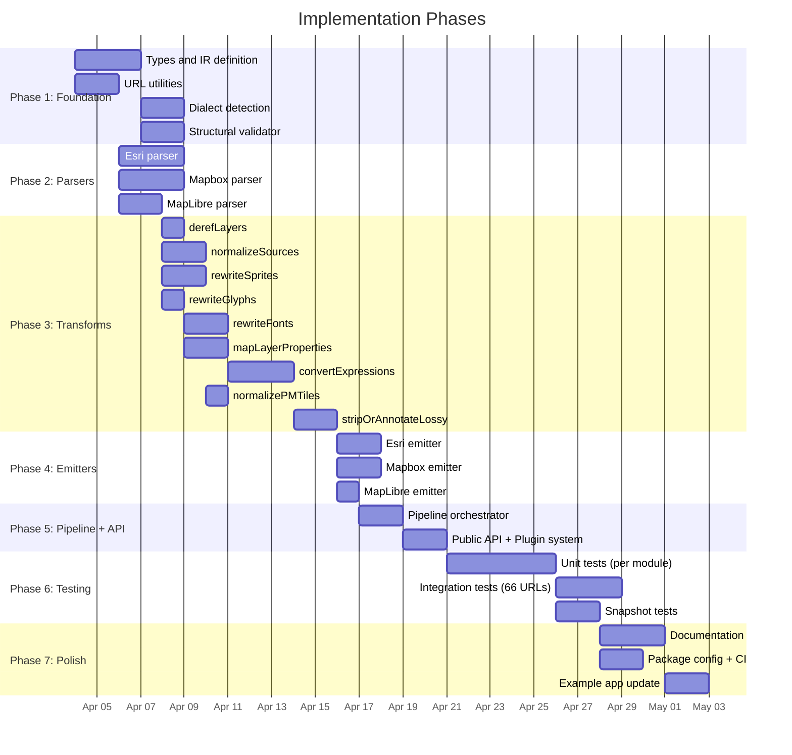

# Implementation Plan

## Phase overview

## Phase 1: Foundation

### 1a. Types and IR definition
- Create `src/types/` directory with all TypeScript interfaces
- `style.ts`: IRStyle, IRSource (all variants), IRLayer (all variants), IRSprite, IRLight, IRSky, IRTerrain, IRTransition
- `dialect.ts`: Dialect type, DialectOutput generic
- `options.ts`: TranspileOptions, TranspileResult, TransformContext
- `plugin.ts`: Plugin interface
- `warnings.ts`: ConversionWarning, warning code constants
- `expressions.ts`: IRExpression, PropertyValue, DataDrivenPropertyValue, LegacyStopsFunction

### 1b. URL utilities
- `src/url/resolve.ts`: Generic relative path resolver (replaces current `resolveUrlPath`)
- `src/url/token.ts`: Token injection/extraction for Esri and Mapbox
- `src/url/mapbox-protocol.ts`: `mapbox://` -> HTTPS expansion functions
- `src/url/pmtiles-protocol.ts`: `pmtiles://` detection and handling

### 1c. Dialect detection
- `src/detect/index.ts`: Main `detect()` function with scoring algorithm
- `src/detect/esri.ts`: Esri signal checkers
- `src/detect/mapbox.ts`: Mapbox signal checkers
- `src/detect/maplibre.ts`: MapLibre signal checkers

### 1d. Structural validator
- `src/validate/index.ts`: `validate()` entry point
- Checks: version === 8, sources is object, layers is array, each layer has id + type, source references exist, sprite/glyphs are string or valid format

## Phase 2: Parsers

### 2a. Esri parser
- Absorbs all logic from current `esriToMapbox.ts`
- Resolves relative sprite, glyph, source paths to absolute URLs
- Converts `source.url` to `source.tiles` with `{z}/{y}/{x}` pattern
- Extracts and propagates Esri tokens
- Handles both relative-path styles and already-resolved styles
- Handles item-based URLs vs VectorTileServer URLs

### 2b. Mapbox parser
- Expands `mapbox://` URLs for sprites, glyphs, sources
- Stashes Mapbox-proprietary top-level properties in `_extensions.mapbox`
- Strips Mapbox API metadata fields (`owner`, `visibility`, `draft`, etc.)
- Handles composite source URLs

### 2c. MapLibre parser
- Largely identity function
- Resolves layer `ref` properties (calls derefLayers)
- Validates version
- Normalizes multi-sprite format

## Phase 3: Transforms

Each transform is a separate file in `src/transforms/`. All are pure functions.

### 3a. derefLayers
- Input: layers array with possible `ref` properties
- Output: all layers fully resolved, no `ref` properties
- Cycle detection included

### 3b. normalizeSources
- Ensure all vector/raster sources have `tiles` array (preferred for IR)
- Preserve `url` if also present (some renderers prefer TileJSON)
- Handle source `scheme` property

### 3c. rewriteSprites
- Ensure sprite URL is absolute
- Handle multi-sprite (MapLibre) vs single sprite (others)
- Inject tokens where needed

### 3d. rewriteGlyphs
- Ensure glyph URL is absolute
- Preserve `{fontstack}` and `{range}` placeholders
- Inject tokens where needed

### 3e. rewriteFonts
- Apply `fontMapping` if provided
- Walk all `text-font` properties in symbol layers
- Handle both literal arrays and expression-based font stacks

### 3f. mapLayerProperties
- Remove dialect-specific paint/layout properties not supported by target
- No property name translations needed for the core set (fill, line, symbol, circle are identical across dialects)

### 3g. convertExpressions
- Optional: convert legacy stops to modern expressions
- Remove dialect-specific expressions not supported by target
- Replace `global-state` with defaults when targeting non-MapLibre

### 3h. normalizePMTiles
- Detect `pmtiles://` source URLs
- Keep for MapLibre target, warn for others

### 3i. stripOrAnnotateLossy
- Final pass to remove or annotate features incompatible with target
- All warnings pushed to context

## Phase 4: Emitters

### 4a. Esri emitter
- Re-relativize sprite, glyph, source URLs (requires `baseUrl`)
- Strip all top-level properties except version, sprite, glyphs, sources, layers
- Convert `source.tiles` back to `source.url = "../../"`

### 4b. Mapbox emitter
- Restore Mapbox-specific extensions from `_extensions.mapbox`
- Optionally convert HTTPS URLs back to `mapbox://` protocol
- Re-inject access token

### 4c. MapLibre emitter
- Keep multi-sprite if present
- Keep MapLibre-specific extensions (sky, terrain, projection, state, font-faces)
- Strip `_extensions`

## Phase 5: Pipeline + API

### 5a. Pipeline orchestrator
- `src/pipeline.ts`: `transpile()` function
- Wires together detect -> parse -> transform chain -> validate -> emit
- Handles string input (JSON parse)
- Handles error wrapping

### 5b. Public API + Plugin system
- `src/index.ts`: Re-export all public types and functions
- Plugin execution in transform pipeline
- Convenience functions: `isEsriStyle()`, `isMapboxStyle()`, `isMaplibreStyle()`

## Phase 6: Testing

### Test strategy
- **Unit tests:** One test file per module (parser, transform, emitter, detect, URL utils)
- **Integration tests:** Use the 66 validated URLs from `public-vector-tile-styles.md` as fixtures
- **Snapshot tests:** Golden file comparisons for known style conversions
- **Round-trip tests:** Esri -> MapLibre -> Esri should produce equivalent output (for the lossless subset)

### Test framework
- Vitest (zero-config, fast, TypeScript-native)
- No test dependencies beyond Vitest

### Key test cases

**Esri parser tests:**
- World_Basemap_v2 root.json (906 layers, complex)
- World_Hillshade_v2 root.json (7 layers, simple)
- Microsoft Building Footprints (fill-extrusion potential)
- USA demographic layers (colon-suffixed source-layers, float zoom)
- Already-resolved Esri style (absolute URLs)
- Token-bearing URL

**Mapbox parser tests:**
- streets-v12 (composite source, fog, projection, 134 layers)
- basic-v9 (simple, older format)
- satellite-v9 (raster + vector sources)

**Detection tests:**
- All 66 URLs from the MD file (fetch + detect)
- Mapbox style JSON samples
- Empty style
- Partially-converted styles

**Round-trip tests:**
- Esri -> MapLibre -> Esri (lossless for core properties)
- MapLibre -> Mapbox -> MapLibre (lossless for shared properties)

## Phase 7: Polish

### Documentation
- Update README.md with new API, examples, and migration guide from v0.x
- API reference (generated from TSDoc comments)
- Add examples for common use cases

### Package config
- Update `package.json`: name, version (1.0.0), exports, sideEffects: false
- tsup config for CJS + ESM + .d.ts
- Add `vitest` to devDependencies
- CI: GitHub Actions for lint, test, build, publish

### Example app
- Update Svelte example to use new `transpile()` API
- Add dialect detection UI
- Show conversion warnings

## Migration from current API

| Current function | New equivalent |
|-----------------|----------------|
| `constructMapboxStyleFromEsri(baseUrl)` | `transpile(style, { fromDialect: "esri", toDialect: "maplibre", baseUrl })` |
| `resolveEsriRelativePaths(baseUrl)` | Esri parser internal (exposed as utility if needed) |
| `constructMapboxStyleFromEsriAbsolute(style)` | `transpile(style, { fromDialect: "esri", toDialect: "maplibre" })` |
| `fetchEsriStyleJson(baseUrl, token)` | Not included in core (fetch-free). Provided as optional utility or example. |

## Naming

The package should be renamed to reflect its broader scope. Suggestions:
- `map-style-transpiler`
- `gl-style-transpiler`
- `vector-style-spec` (mirrors `maplibre-style-spec`)
- `style-shuttle` (short, memorable)

The name should not be Esri-specific or Mapbox-specific since it now handles all three dialects bidirectionally.
