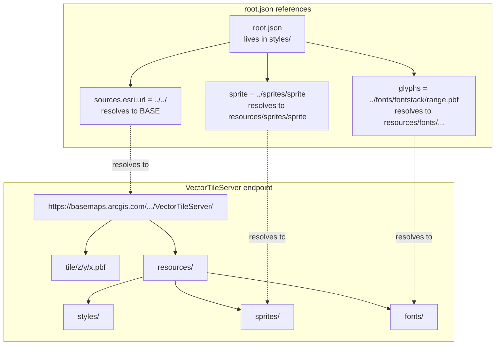
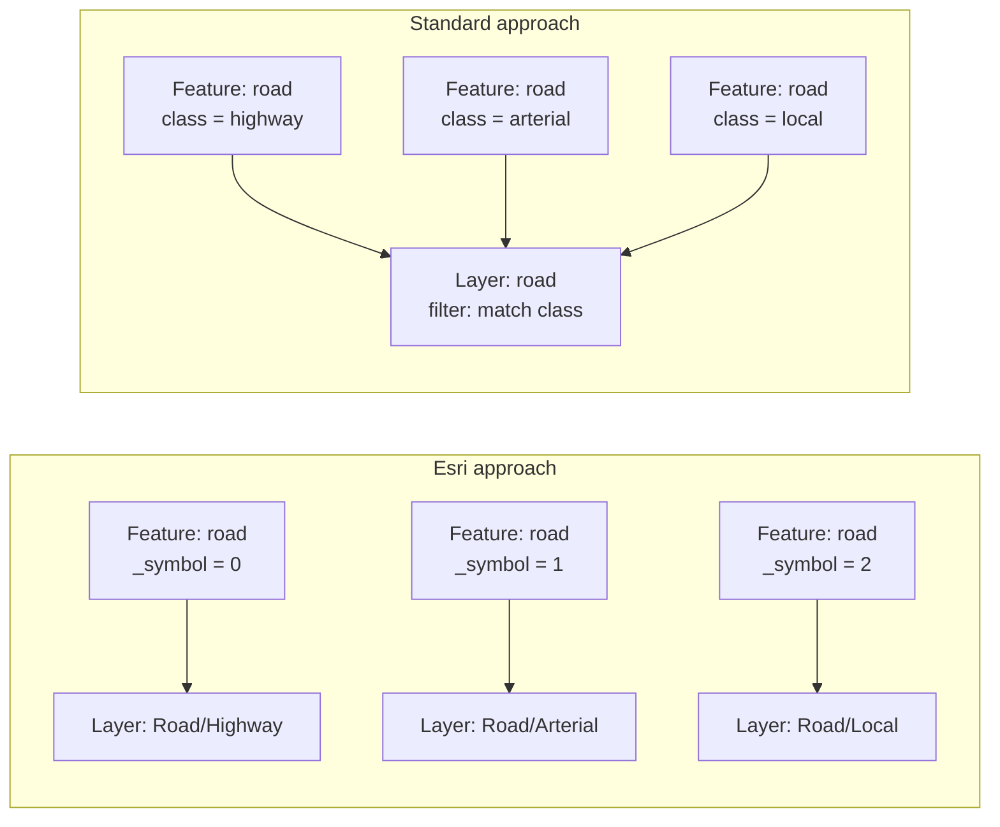

# Esri VectorTileServer Style Anatomy

Deep analysis based on fetching and comparing 5 real Esri root.json files across different service types.

## Universal structure

Every Esri root.json contains exactly 5 top-level keys:

```json
{
  "version": 8,
  "sprite": "../sprites/sprite",
  "glyphs": "../fonts/{fontstack}/{range}.pbf",
  "sources": {
    "esri": {
      "type": "vector",
      "url": "../../"
    }
  },
  "layers": [...]
}
```

No `name`, `metadata`, `center`, `zoom`, `bearing`, `pitch`, `light`, `sky`, `terrain`, or `transition`. Ever. Across all services tested.

## URL relationship diagram



## The `_symbol` classification system

Esri's most distinctive pattern. Features are pre-classified at publish time with an integer `_symbol` attribute baked into the tile data.



**In Esri:** One layer per symbol class, filter is always `["==", "_symbol", N]`
**In standard:** One layer with `match`/`case` expression on feature properties

### Statistics from real styles

| Service | Total layers | Layers using `_symbol` | Percentage |
|---------|-------------|----------------------|------------|
| World_Basemap_v2 | 906 | 874 | 96% |
| OpenStreetMap_v2 | 1524 | 1487 | 97.6% |
| World_Hillshade_v2 | 7 | 7 | 100% |
| Microsoft Buildings | 51 | ~48 | ~94% |
| USA Population Density | ~30 | ~28 | ~93% |

## Layer ID naming convention

Esri layer IDs use slashes as namespace separators:

```
{source-layer}/{variant-description}
```

Examples:
- `"Land/Not ice"` - source-layer `Land`, variant "Not ice"
- `"Land/Ice"` - source-layer `Land`, variant "Ice"  
- `"Road/Highway"` - source-layer `Road`, variant "Highway"
- `"Hillshade/Shadow Base/1"` - nested with numeric suffix
- `"Daylight address area/label/Number/Unit"` - deeply nested (OSM v2)
- `"Block Group/0 - 1,000 people per sq mi"` - classification range

**96-98% of all Esri layers use slash-namespaced IDs.** This is structural, not incidental.

## Font usage

Esri styles use a small set of system-like fonts:

| Font | Usage |
|------|-------|
| `Arial Regular` | Body text, most labels |
| `Arial Bold` | Emphasis, headings |
| `Arial Italic` | Water labels, notes |
| `Arial Unicode MS Regular` | Fallback for CJK and special characters |
| `Arial Unicode MS Bold` | Bold CJK fallback |

These are SDF (Signed Distance Field) PBF glyphs hosted on the Esri tile server, not system fonts.

## Text field tokens

Esri uses underscore-prefixed attribute names for label text:

| Token | Meaning | Found in |
|-------|---------|----------|
| `{_name}` | Primary display name | All basemaps |
| `{_name_global}` | Global/international name variant | World basemaps |
| `{_name1}` to `{_name42}` | Language variants or line-break segments | OpenStreetMap v2 |

These are pre-processed display strings stored in the tile data, not raw source attributes like OSM's `name` tag.

## Zoom-generalized source-layers (colon pattern)

Some Esri services serve the same feature class at different generalizations across zoom ranges:

```
"County:1"  (minzoom: 3.96, maxzoom: 4.89)
"County:2"  (minzoom: 4.89, maxzoom: 6.62)  
"County:3"  (minzoom: 6.62, maxzoom: 7.21)
```

The colon and number are internal to the VTPK tile schema. Each numbered variant contains progressively more detailed geometry.

## Float-precision zoom levels

Esri styles use fractional zoom values derived from map scale denominators:

```
minzoom: 0.98, 3.96, 4.89, 6.62, 7.21, 9.95, 11.85
```

These are valid in MapLibre/Mapbox (both accept float zoom). No rounding needed.

## Expression usage: legacy only

**Every Esri style uses legacy stop-function syntax exclusively:**

```json
{
  "fill-color": {
    "stops": [[9, "#e3debe"], [12, "#f7f6d5"]]
  }
}
```

No modern expressions (`interpolate`, `match`, `case`, `step`). No data-driven expressions with `property` stops. Only camera-based zoom interpolation.

This is consistent across all tested services (basemaps, demographics, buildings, OSM).

## Sprite naming conventions

Sprite icon IDs in Esri styles mirror the slash-namespaced layer ID pattern:

```
"icon-image": "railway (tunnel)/disused"
"icon-image": "natural cliff/0"
"fill-pattern": "wetland/salt marsh land"
```

The sprite sheet is a single PNG with all icons. The sprite index (`.json`) maps these slash-containing names to pixel coordinates in the sheet.

## VectorTileServer REST endpoint

The VectorTileServer base URL (what `../../` resolves to) is also a REST endpoint:

```
GET {base}?f=json
```

Returns metadata including:
- `tiles`: `["tile/{z}/{y}/{x}.pbf"]`
- `tileInfo`: tile matrix set (levels, origin, resolution, scale)
- `maxScale` / `minScale`
- `initialExtent` / `fullExtent`
- `spatialReference`: `{ wkid: 3857 }` or `{ wkid: 4326 }` etc.
- `capabilities`: `"TilesOnly"` or `"Map,TilesOnly"`
- `maxLOD` / `minLOD`

This metadata is NOT in the root.json style itself. If needed (e.g., for bounds, attribution, projection detection), it must be fetched separately.

## Conversion implications summary

| Esri feature | Conversion needed? | Target compatibility |
|-------------|-------------------|---------------------|
| Relative URLs (`../`, `../../`) | Yes, resolve to absolute | Required for MapLibre/Mapbox |
| `_symbol` filters | No | Valid in all dialects |
| Slash layer IDs | No | Valid in all modern renderers |
| Legacy stops | No (optional modernization) | Supported by all dialects |
| `{_name}` text tokens | No transformation, but won't work with non-Esri tiles | Data-dependent |
| Colon source-layers | No | Valid string identifiers |
| Float zoom values | No | Accepted by all renderers |
| Arial fonts | No transformation, but may need mapping | Font server dependent |
| `{z}/{y}/{x}` tile order | Set correctly during source normalization | Handled by tile URL template |
