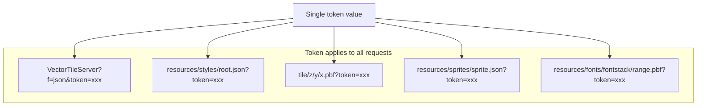
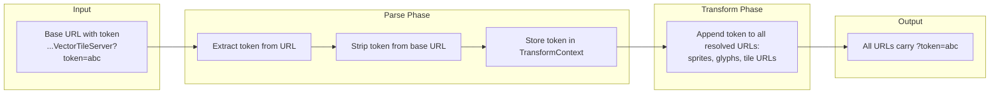
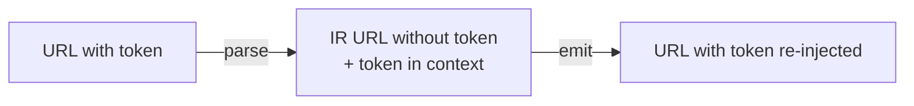

# Esri Authentication Patterns

## Overview

Esri services use a unified token system. One token value covers all sub-requests: metadata (`?f=json`), tiles, sprites, glyphs, and the style JSON itself.



## Token types

| Token type | Lifetime | How to get it | Use case |
|-----------|----------|---------------|----------|
| API Key Credentials | Up to 1 year | Developer dashboard | Public apps, basemaps, location services |
| OAuth2 Client Credentials | 2 hours default, 14 days max | `POST /oauth2/token` with client_id + client_secret | Server-side apps |
| OAuth2 User Token | 30 min access, 2 week refresh | Authorization code flow (user login) | Private items, subscriber content |
| Legacy generateToken | Configurable | `POST /sharing/rest/generateToken` | ArcGIS Enterprise, older apps |
| Legacy API Key | Until June 2026 retirement | Developer dashboard (legacy) | Being retired |

## How tokens appear in requests

### Query parameter (most common)

```
?token=<ACCESS_TOKEN>
```

This is the universal pattern. Works for all endpoints. The transpiler uses this approach.

**Important:** There is no `?apiKey=` parameter. API keys use the same `?token=` parameter as OAuth tokens. The value changes, the parameter name does not.

### HTTP headers (recommended by Esri for security)

```
X-Esri-Authorization: Bearer <ACCESS_TOKEN>
```

Preferred over query params because it prevents tokens from appearing in server logs, proxy caches, and browser history. Supported from ArcGIS Server 10.5.1+.

Also supported (when web-tier auth is not active):
```
Authorization: Bearer <ACCESS_TOKEN>
```

### Referrer-based restrictions

Tokens can be locked to specific referrer domains:
- API Key Credentials: configure allowed domains in developer dashboard
- generateToken: pass `client=referer&referer=https://myapp.example.com`

Requests from non-matching origins are rejected even with a valid token.

## Token in the transpiler

### How tokens flow through the pipeline



### Token extraction

The token can appear in:

1. **The base URL query string** (most common user input):
   ```
   https://tiles.arcgis.com/.../VectorTileServer?token=abc123
   ```

2. **Already embedded in sprite/glyph URLs** (if style was pre-resolved):
   ```
   "sprite": "https://tiles.arcgis.com/.../sprites/sprite?token=abc123"
   ```

3. **Provided separately** via `options.token`:
   ```typescript
   transpile(style, { fromDialect: "esri", toDialect: "maplibre", token: "abc123" })
   ```

### Token injection rules

When emitting, the token must be appended to every URL that points to the secured service:

| Resource | URL pattern | Token appended |
|----------|-------------|---------------|
| Tile requests | `.../tile/z/y/x.pbf` | Yes |
| Sprite index | `.../sprites/sprite.json` | Yes |
| Sprite sheet | `.../sprites/sprite.png` | Yes |
| Sprite HiDPI | `.../sprites/sprite@2x.json` and `.png` | Yes |
| Glyph PBFs | `.../fonts/fontstack/range.pbf` | Yes |
| TileJSON metadata | `.../VectorTileServer?f=json` | Yes |

### Token priority

If the same token appears in multiple places, use this priority:

1. `options.token` (explicit user input, highest priority)
2. Token in the base URL query string
3. Token already in the style JSON's sprite/glyph/source URLs

## Detecting if auth is required

Make an unauthenticated request to the VectorTileServer endpoint:

```
GET https://tiles.arcgis.com/.../VectorTileServer?f=json
```

**Public service response:** HTTP 200 with valid JSON metadata.

**Secured service response:** HTTP 200 with error body:
```json
{
  "error": {
    "code": 499,
    "message": "Token Required",
    "details": []
  }
}
```

Error codes:
- **499**: Token required (no token provided)
- **498**: Token expired or invalid
- **403**: Token valid but insufficient privileges

**Note:** Error 499 is Esri-specific, not a standard HTTP status. It may come as a 200 HTTP response with the error in the JSON body, or as an actual HTTP 499 status depending on server configuration.

## ArcGIS Online vs ArcGIS Enterprise

| Aspect | ArcGIS Online | ArcGIS Enterprise |
|--------|---------------|-------------------|
| Hosts | arcgis.com, tiles.arcgis.com, basemaps.arcgis.com | Custom domains |
| Token endpoint | `https://www.arcgis.com/sharing/rest/oauth2/token` | `https://portal-host/portal/sharing/rest/generateToken` |
| Auth methods | OAuth2, API keys only | OAuth2, API keys, IWA, PKI, LDAP |
| `Authorization` header | Works | Only when web-tier auth is NOT active |
| `X-Esri-Authorization` header | Works | Works (always, even with web-tier auth) |
| Federated servers | N/A | Token must come from portal, not server |
| Max token expiry | Per token type (see table above) | Configurable by portal admin |

### Enterprise federated server gotcha

For ArcGIS Enterprise with federated servers, the token must be generated from the **portal's** token endpoint, not from the ArcGIS Server's own endpoint. A token generated from the server's `/tokens/generateToken` will be rejected by the federated service.

```
Correct:   https://portal.example.com/portal/sharing/rest/generateToken
Incorrect: https://server.example.com/arcgis/tokens/generateToken
```

## Public vs private Esri services

### Public services (no token needed)

Most Esri Living Atlas basemaps are publicly accessible:
- `basemaps.arcgis.com/arcgis/rest/services/World_Basemap_v2/VectorTileServer` - PUBLIC
- `basemaps.arcgis.com/arcgis/rest/services/World_Hillshade_v2/VectorTileServer` - PUBLIC
- `basemaps.arcgis.com/arcgis/rest/services/OpenStreetMap_v2/VectorTileServer` - PUBLIC

User-hosted public services on `tiles.arcgis.com` are also often public (sharing = "Everyone").

### Subscriber content (org token needed)

Some Living Atlas layers require an ArcGIS organizational account:
- Premium demographic data
- Certain imagery layers
- Licensed content

### Private hosted services

User-published services with restricted sharing require a user/app token with access to that specific item.

## Transpiler implementation

### Token handling in parsers/esri.ts

```typescript
function parseEsriToken(baseUrl: string, options: TranspileOptions): string | null {
  // Priority 1: explicit option
  if (options.token) return options.token;
  
  // Priority 2: extract from base URL
  try {
    const url = new URL(baseUrl);
    const token = url.searchParams.get("token");
    if (token) return token;
  } catch {
    // not a valid URL, no token
  }
  
  return null;
}
```

### Token injection in emitters

```typescript
function appendToken(url: string, token: string | null): string {
  if (!token) return url;
  const separator = url.includes("?") ? "&" : "?";
  return `${url}${separator}token=${encodeURIComponent(token)}`;
}
```

### Token stripping for IR

In the canonical IR, URLs should be stored **without** tokens. Tokens are re-injected during emit. This prevents token leakage if the IR is serialized or logged.



### Warning codes

| Code | When |
|------|------|
| `ESRI_TOKEN_DETECTED` | Info: token found and will be propagated |
| `ESRI_TOKEN_EXPIRED` | Warn: token expiry detected (if timestamp is parseable) |
| `ESRI_TOKEN_MISSING` | Warn: service appears to require auth but no token provided |
| `ESRI_TOKEN_IN_OUTPUT` | Info: output URLs contain a token (security reminder) |

## Security considerations

1. **Tokens in URLs are visible** in server logs, browser history, and network traces. Document that users should prefer header-based auth at the application level.
2. **The transpiler output may contain tokens.** If the output is stored, shared, or committed to version control, tokens will be exposed. The transpiler should emit an `ESRI_TOKEN_IN_OUTPUT` info warning.
3. **Token-free IR:** The canonical IR stores URLs without tokens. This is safer for intermediate processing, logging, and debugging.
4. **No token validation.** The transpiler does not validate tokens, check expiry, or refresh them. That is the application's responsibility.
